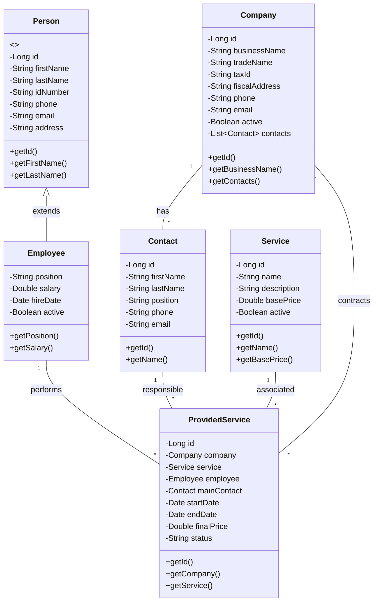

# Mini ERP System

A simple ERP system built with Spring Boot and React, focused on managing companies, employees, and services.

## Project Structure

### Class Diagram

## Technologies Used
- Backend: Spring Boot 3.x
- Frontend: React + Vite
- Database: PostgreSQL (H2 for development)
- Deployment: Railway.app & Vercel

## Project Setup
[Setup instructions will be added as the project progresses]

## Features
- Company Management
- Employee Management
- Service Management
- Service Provision Tracking

## Development Status
🚧 Under Construction 🚧